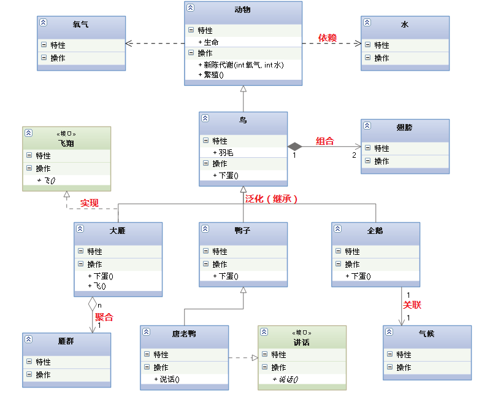
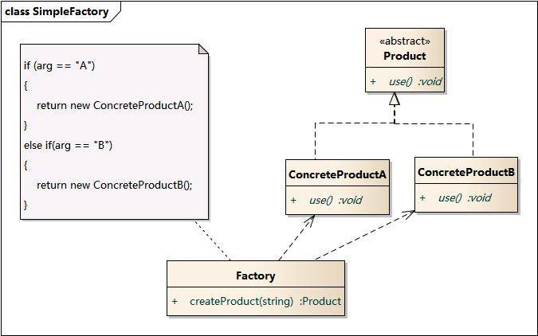
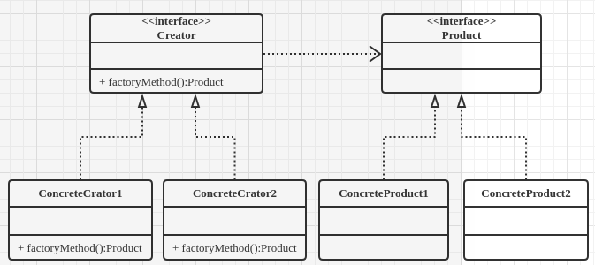

# 一、六大设计原则
单一职责原则（SRP）：一个类只负责一个职责，不要存在多个导致类变更的原因
<br/>
开闭原则(OCP)： 对扩展开放，对修改封闭
<br/>
里氏替换原则(LSP)：子类必须能够替换他们的基类
<br/>
依赖倒置原则（DIP）：提高灵活性，高层不依赖低层，两个都应该依赖于抽象
<br/>
迪米特原则(LOD)：类间解耦，类之间联系尽可能少
<br/>
接口隔离原则（ISP）：客户端不应该依赖它不需要的接口，多用组合，少用继承
<br/><br/>
设计模式主要分三个类型:  (总计23种)
* <b>创建型：（5种) </b><br/>
&emsp;&emsp;工方法模式、抽象工厂模式、单例模式、建造者模式
* <b>结构型：（7种) </b><br/>
&emsp;&emsp;适配器模式、装饰模式、代理模式、外观模式、桥接模式、组合模式、享元模式
* <b>行为型：（11种）</b><br/>
&emsp;&emsp;策略模式、模板方法模式、观察者模式、迭代器模式、责任链模式、命令模式、备忘录模式、状态模式、访问者模式、中介者模式、解释器模式

## UML图解：


***

# 二、创建型模式
创建型模式(Creational Pattern)对类的实例化过程进行了抽象，能够将软件模块中对象的创建和对象的使用分离。为了使软件的结构更加清晰，外界对于这些对象只需要知道它们共同的接口，而不清楚其具体的实现细节，使整个系统的设计更加符合单一职责原则。
创建型模式隐藏了类的实例的创建细节，通过隐藏对象如何被创建和组合在一起达到使整个系统独立的目的。
<br/>
## 工厂方法模式（Factory Method Pattern）
<b>简单工厂类图：</b><br/>
 <br/>
<b>工厂方法类图：</b><br/>
 <br/>
<br/>
工厂方法模式是简单工厂模式的进一步抽象和推广。由于使用了面向对象的多态性，工厂方法模式保持了简单工厂模式的优点，而且克服了它的缺点。在工厂方法模式中，核心的工厂类不再负责所有产品的创建，而是将具体创建工作交给子类去做。这个核心类仅仅负责给出具体工厂必须实现的接口，而不负责哪一个产品类被实例化这种细节，这使得工厂方法模式可以允许系统在不修改工厂角色的情况下引进新产品。
<br/>
<b>使用反射实现工厂模式：</b>
```
public abstract class Factory {
    public abstract <T extends Product> T createProduct(Class<T> clz);
}

public class ConcreteFactory extends Factory {

    @Override
    public <T extends Product> T createProduct(Class<T> clz) {
        Product p = null;
        try {
            p = (Product) Class.from(clz.getName()).newInstance();
        } catch(Exception e) {
       }
        return (T) p;
    }
}
```
### 优点：
* 在工厂方法模式中，工厂方法用来创建客户所需要的产品，同时还向客户隐藏了哪种具体产品类将被实例化这一细节，用户只需要关心所需产品对应的工厂，无须关心创建细节，甚至无须知道具体产品类的类名。
* 基于工厂角色和产品角色的多态性设计是工厂方法模式的关键。它能够使工厂可以自主确定创建何种产品对象，而如何创建这个对象的细节则完全封装在具体工厂内部。工厂方法模式之所以又被称为多态工厂模式，是因为所有的具体工厂类都具有同一抽象父类。
* 使用工厂方法模式的另一个优点是在系统中加入新产品时，无须修改抽象工厂和抽象产品提供的接口，无须修改客户端，也无须修改其他的具体工厂和具体产品，而只要添加一个具体工厂和具体产品就可以了。这样，系统的可扩展性也就变得非常好，完全符合“开闭原则”。
### 缺点：
* 在添加新产品时，需要编写新的具体产品类，而且还要提供与之对应的具体工厂类，系统中类的个数将成对增加，在一定程度上增加了系统的复杂度，有更多的类需要编译和运行，会给系统带来一些额外的开销。
* 由于考虑到系统的可扩展性，需要引入抽象层，在客户端代码中均使用抽象层进行定义，增加了系统的抽象性和理解难度，且在实现时可能需要用到DOM、反射等技术，增加了系统的实现难度。
### 适用环境：
* 一个类不知道它所需要的对象的类：在工厂方法模式中，客户端不需要知道具体产品类的类名，只需要知道所对应的工厂即可，具体的产品对象由具体工厂类创建；客户端需要知道创建具体产品的工厂类。
* 一个类通过其子类来指定创建哪个对象：在工厂方法模式中，对于抽象工厂类只需要提供一个创建产品的接口，而由其子类来确定具体要创建的对象，利用面向对象的多态性和里氏代换原则，在程序运行时，子类对象将覆盖父类对象，从而使得系统更容易扩展。
* 将创建对象的任务委托给多个工厂子类中的某一个，客户端在使用时可以无须关心是哪一个工厂子类创建产品子类，需要时再动态指定，可将具体工厂类的类名存储在配置文件或数据库中。
