## 一、六大设计原则
单一职责原则（SRP）：一个类只负责一个职责，不要存在多个导致类变更的原因
<br/>
开闭原则(OCP)： 对扩展开放，对修改封闭
<br/>
里氏替换原则(LSP)：子类必须能够替换他们的基类
<br/>
依赖倒置原则（DIP）：提高灵活性，高层不依赖低层，两个都应该依赖于抽象
<br/>
迪米特原则(LOD)：类间解耦，类之间联系尽可能少
<br/>
接口隔离原则（ISP）：客户端不应该依赖它不需要的接口，多用组合，少用继承
<br/><br/>
设计模式主要分三个类型:  (总计23种)
* <b>创建型：（5种) </b><br/>
&emsp;&emsp;工方法模式、抽象工厂模式、单例模式、建造者模式、原型模式
* <b>结构型：（7种) </b><br/>
&emsp;&emsp;适配器模式、装饰模式、代理模式、外观模式、桥接模式、组合模式、享元模式
* <b>行为型：（11种）</b><br/>
&emsp;&emsp;策略模式、模板方法模式、观察者模式、迭代器模式、责任链模式、命令模式、备忘录模式、状态模式、访问者模式、中介者模式、解释器模式

### UML图解：
 <br/>
***
## 二、创建型模式
创建型模式(Creational Pattern)对类的实例化过程进行了抽象，能够将软件模块中对象的创建和对象的使用分离。为了使软件的结构更加清晰，外界对于这些对象只需要知道它们共同的接口，而不清楚其具体的实现细节，使整个系统的设计更加符合单一职责原则。
创建型模式隐藏了类的实例的创建细节，通过隐藏对象如何被创建和组合在一起达到使整个系统独立的目的。
<br/>
### 1. 工厂方法模式（Factory Method Pattern）
<b>简单工厂类图：</b><br/>
 <br/>
<b>工厂方法类图：</b><br/>
 <br/>
<br/>
&emsp;&emsp;工厂方法模式是简单工厂模式的进一步抽象和推广。由于使用了面向对象的多态性，工厂方法模式保持了简单工厂模式的优点，而且克服了它的缺点。在工厂方法模式中，核心的工厂类不再负责所有产品的创建，而是将具体创建工作交给子类去做。这个核心类仅仅负责给出具体工厂必须实现的接口，而不负责哪一个产品类被实例化这种细节，这使得工厂方法模式可以允许系统在不修改工厂角色的情况下引进新产品。
<br/>
<b>使用反射实现工厂模式：</b>
```
public abstract class Factory {
    public abstract <T extends Product> T createProduct(Class<T> clz);
}

public class ConcreteFactory extends Factory {

    @Override
    public <T extends Product> T createProduct(Class<T> clz) {
        Product p = null;
        try {
            p = (Product) Class.from(clz.getName()).newInstance();
        } catch(Exception e) {
       }
        return (T) p;
    }
}
```
#### 优点：
* 在工厂方法模式中，工厂方法用来创建客户所需要的产品，同时还向客户隐藏了哪种具体产品类将被实例化这一细节，用户只需要关心所需产品对应的工厂，无须关心创建细节，甚至无须知道具体产品类的类名。
* 基于工厂角色和产品角色的多态性设计是工厂方法模式的关键。它能够使工厂可以自主确定创建何种产品对象，而如何创建这个对象的细节则完全封装在具体工厂内部。工厂方法模式之所以又被称为多态工厂模式，是因为所有的具体工厂类都具有同一抽象父类。
* 使用工厂方法模式的另一个优点是在系统中加入新产品时，无须修改抽象工厂和抽象产品提供的接口，无须修改客户端，也无须修改其他的具体工厂和具体产品，而只要添加一个具体工厂和具体产品就可以了。这样，系统的可扩展性也就变得非常好，完全符合“开闭原则”。
#### 缺点：
* 在添加新产品时，需要编写新的具体产品类，而且还要提供与之对应的具体工厂类，系统中类的个数将成对增加，在一定程度上增加了系统的复杂度，有更多的类需要编译和运行，会给系统带来一些额外的开销。
* 由于考虑到系统的可扩展性，需要引入抽象层，在客户端代码中均使用抽象层进行定义，增加了系统的抽象性和理解难度，且在实现时可能需要用到DOM(Document Object Model)、反射等技术，增加了系统的实现难度。
#### 适用环境：
* 一个类不知道它所需要的对象的类：在工厂方法模式中，客户端不需要知道具体产品类的类名，只需要知道所对应的工厂即可，具体的产品对象由具体工厂类创建；客户端需要知道创建具体产品的工厂类。
* 一个类通过其子类来指定创建哪个对象：在工厂方法模式中，对于抽象工厂类只需要提供一个创建产品的接口，而由其子类来确定具体要创建的对象，利用面向对象的多态性和里氏代换原则，在程序运行时，子类对象将覆盖父类对象，从而使得系统更容易扩展。
* 将创建对象的任务委托给多个工厂子类中的某一个，客户端在使用时可以无须关心是哪一个工厂子类创建产品子类，需要时再动态指定，可将具体工厂类的类名存储在配置文件或数据库中。

### 2. 抽象工厂模式（Abstract Factory Pattern）
&emsp;&emsp;为创建一组相关或者是相互依赖的对象提供一个接口，而不需要指定它们的具体类。<br/>
<b>类图:</b>
<br/>
<br/>
#### 优点：
* 抽象工厂模式隔离了具体类的生成，使得客户并不需要知道什么被创建。由于这种隔离，更换一个具体工厂就变得相对容易。所有的具体工厂都实现了抽象工厂中定义的那些公共接口，因此只需改变具体工厂的实例，就可以在某种程度上改变整个软件系统的行为。另外，应用抽象工厂模式可以实现高内聚低耦合的设计目的，因此抽象工厂模式得到了广泛的应用。
* 当一个产品族中的多个对象被设计成一起工作时，它能够保证客户端始终只使用同一个产品族中的对象。这对一些需要根据当前环境来决定其行为的软件系统来说，是一种非常实用的设计模式。
* 增加新的具体工厂和产品族很方便，无须修改已有系统，符合“开闭原则”。
#### 缺点：
* 在添加新的产品对象时，难以扩展抽象工厂来生产新种类的产品，这是因为在抽象工厂角色中规定了所有可能被创建的产品集合，要支持新种类的产品就意味着要对该接口进行扩展，而这将涉及到对抽象工厂角色及其所有子类的修改，显然会带来较大的不便。
* 开闭原则的倾斜性（增加新的工厂和产品族容易，增加新的产品等级结构麻烦）。
#### 适用环境：
* 一个系统不应当依赖于产品类实例如何被创建、组合和表达的细节，这对于所有类型的工厂模式都是重要的。
* 系统中有多于一个的产品族，而每次只使用其中某一产品族。
* 属于同一个产品族的产品将在一起使用，这一约束必须在系统的设计中体现出来。
* 系统提供一个产品类的库，所有的产品以同样的接口出现，从而使客户端不依赖于具体实现。
### 3. 单例模式（Singleton Pattern）
DCL（Double Check Locking）<br/>
```
public static Singleton getInstance() {  
    if (instance == null) {  
        synchronized (instance) {  
            if (instance == null) {  
                instance = new Singleton();  
            }  
        }  
    }  
    return instance;  
}
```
（1）给Singleton的实例分配内存；<br/>
（2）调用Singleton()的构造函数，初始化成员字段；<br/>
（3）将instance对象指向分配的内存空间（此时instance不再是null了）<br/>

<b>DCL的错误情况：</b><br/>
JDK1.5之前JMM(Java Memory Model)中Cache、寄存器到内存回写顺序的规定，上面第二和第三的顺序是无法保证的)。JDK1.5之后，volatile字段
在Java指令中创建对象和赋值操作是分开进行的，也就是说instance = new Singleton();语句是分两步执行的。但是JVM并不保证这两个操作的先后顺序，也就是说有可能JVM会为新的Singleton实例分配空间，然后直接赋值给instance成员，然后再去初始化这个Singleton实例。这样就可能出错了，我们以A、B两个线程为例：
</br>&emsp;a>A、B线程同时进入了第一个if判断
</br>&emsp;b>A首先进入synchronized块，由于instance为null，所以它执行instance = new Singleton();
</br>&emsp;c>由于JVM内部的优化机制，JVM先画出了一些分配给Singleton实例的空白内存，并赋值给instance成员（注意此时JVM没有开始初始化这个实例），然后A离开了synchronized块。
</br>&emsp;d>B进入synchronized块，由于instance此时不是null，因此它马上离开了synchronized块并将结果返回给调用该方法的程序。
</br>&emsp;e>此时B线程打算使用Singleton实例，却发现它没有被初始化，于是错误发生了。

<b>不同的类装载器，可能会导致产生多个单例对象:</b><br/>
```
public static Class getClass(String className) throws ClassNotFoundException {
    ClassLoader cl = Thread.currentThread().getContextClassLoader();
    if (cl == null) {
        cl = Singleton.class.getClassLoader();
    }
    return cl.loadClass(className);
}
```
<b>如果Singleton实现了Serializable接口，反序列化时可能产生多个实例对象：</b><br/>
```
重写readResolve方法
private Object readResolve() {
    return instance;
}
```
### 4. 建造者模式（Builder Pattern）
<b>类图：</b><br/>
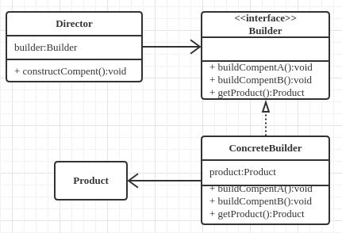<br/>
建造者模式的结构中还引入了一个指挥者类Director，该类的作用主要有两个：一方面它隔离了客户与生产过程；另一方面它负责控制产品的生成过程。指挥者针对抽象建造者编程，客户端只需要知道具体建造者的类型，即可通过指挥者类调用建造者的相关方法，返回一个完整的产品对象。
在客户端代码中，无须关心产品对象的具体组装过程，只需确定具体建造者的类型即可，建造者模式将复杂对象 的构建与对象的表现分离开来，这样使得同样的构建过程可以创建出不同的表现。
#### 优点：
* 在建造者模式中， 客户端不必知道产品内部组成的细节，将产品本身与产品的创建过程解耦，使得相同的创建过程可以创建不同的产品对象。
* 每一个具体建造者都相对独立，而与其他的具体建造者无关，因此可以很方便地替换具体建造者或增加新的具体建造者， 用户使用不同的具体建造者即可得到不同的产品对象 。
* 可以更加精细地控制产品的创建过程 。将复杂产品的创建步骤分解在不同的方法中，使得创建过程更加清晰，也更方便使用程序来控制创建过程。
* 增加新的具体建造者无须修改原有类库的代码，指挥者类针对抽象建造者类编程，系统扩展方便，符合“开闭原则”。
#### 缺点：
* 建造者模式所创建的产品一般具有较多的共同点，其组成部分相似，如果产品之间的差异性很大，则不适合使用建造者模式，因此其使用范围受到一定的限制。
* 如果产品的内部变化复杂，可能会导致需要定义很多具体建造者类来实现这种变化，导致系统变得很庞大。
#### 适用环境：
* 需要生成的产品对象有复杂的内部结构，这些产品对象通常包含多个成员属性。
* 需要生成的产品对象的属性相互依赖，需要指定其生成顺序。
* 对象的创建过程独立于创建该对象的类。在建造者模式中引入了指挥者类，将创建过程封装在指挥者类中，而不在建造者类中。
* 隔离复杂对象的创建和使用，并使得相同的创建过程可以创建不同的产品。
### 5. 原型模式（Prototype Pattern）
<b>类图：</b><br/>
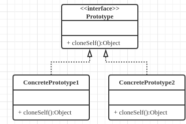 <br/>
<b>浅复制 & 深复制</b>
***
## 三、结构型模式
结构型模式(Structural Pattern)描述如何将类或者对象结合在一起形成更大的结构，就像搭积木，可以通过 简单积木的组合形成复杂的、功能更为强大的结构。<br/>
结构型模式可以分为类结构型模式和对象结构型模式：<br/>
* 类结构型模式：  关心类的组合，由多个类可以组合成一个更大的系统，在类结构型模式中一般只存在继承关系和实现关系。
* 对象结构型模式：  关心类与对象的组合，通过关联关系使得在一 个类中定义另一个类的实例对象，然后通过该对象调用其方法。

根据“合成复用原则”，在系统中尽量使用关联关系来替代继承关系，因此大部分结构型模式都是对象结构型模式。<br/>

### 1、适配器模式(Adapter Pattern)
&emsp;&emsp;将一个类的接口转换成客户希望的另一个接口。Adapter模式使得原本由于接口不兼容而不能一起工作的那些类可以一起工作。<br/>
<b>1)、类适配:</b><br/>
 <br/>
<b>2)、对象适配:</b><br/>
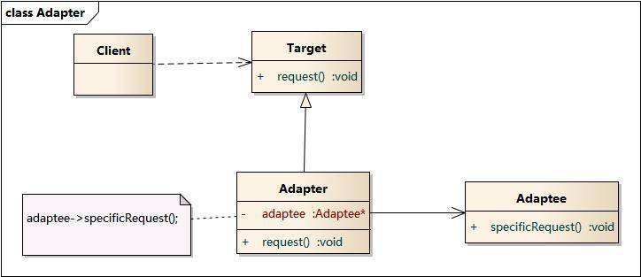 <br/>
#### 优点：
* 将目标类和适配者类解耦，通过引入一个适配器类来重用现有的适配者类，而无须修改原有代码。
* 增加了类的透明性和复用性，将具体的实现封装在适配者类中，对于客户端类来说是透明的，而且提高了适配者的复用性。
* 灵活性和扩展性都非常好，通过使用配置文件，可以很方便地更换适配器，也可以在不修改原有代码的基础上增加新的适配器类，完全符合“开闭原则”。

类适配器模式还具有如下优点：<br/>
&emsp;&emsp;由于适配器类是适配者类的子类，因此可以在适配器类中置换一些适配者的方法，使得适配器的灵活性更强。<br/>
对象适配器模式还具有如下优点：<br/>
&emsp;&emsp;一个对象适配器可以把多个不同的适配者适配到同一个目标，也就是说，同一个适配器可以把适配者类和它的子类都适配到目标接口。<br/>
#### 缺点：
<b>类适配器模式的缺点如下：</b><br/>
&emsp;&emsp;对于Java、C#等不支持多重继承的语言，一次最多只能适配一个适配者类，而且目标抽象类只能为抽象类，不能为具体类，其使用有一定的局限性，不能将一个适配者类和它的子类都适配到目标接口。<br/>
<b>对象适配器模式的缺点如下：</b><br/>
&emsp;&emsp;与类适配器模式相比，要想置换适配者类的方法就不容易。如果一定要置换掉适配者类的一个或多个方法，就只好先做一个适配者类的子类，将适配者类的方法置换掉，然后再把适配者类的子类当做真正的适配者进行适配，实现过程较为复杂。<br/>
#### 适用环境：
* 想要建立一个可以重复使用的类，用于与一些彼此之间没有太大关联的一些类，包括一些可能在将来引进的类一起工作。
* 系统需要使用现有的类，而这些类的接口不符合系统的需要。
### 2、装饰模式（Decorator Pattern）
&emsp;&emsp;动态的给对象添加一些额外的职责。就功能来说装饰模式相比生成子类更为灵活。<br/>
<b>类图：</b><br/>
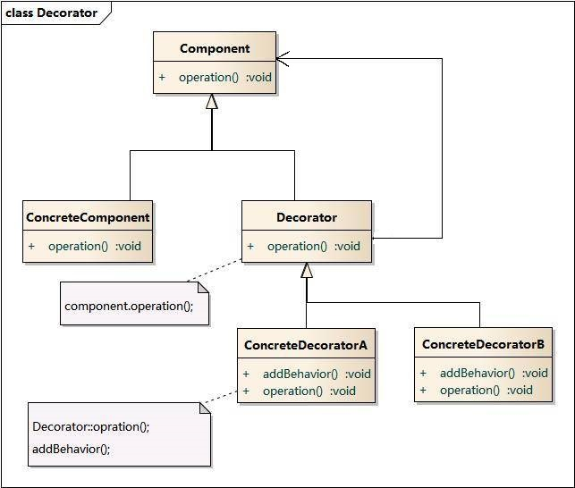 <br/>
#### 优点：
* 装饰模式与继承关系的目的都是要扩展对象的功能，但是装饰模式可以提供比继承更多的灵活性。
* 可以通过一种动态的方式来扩展一个对象的功能，通过配置文件可以在运行时选择不同的装饰器，从而实现不同的行为。
* 通过使用不同的具体装饰类以及这些装饰类的排列组合，可以创造出很多不同行为的组合。可以使用多个具体装饰类来装饰同一对象，得到功能更为强大的对象。
* 具体构件类与具体装饰类可以独立变化，用户可以根据需要增加新的具体构件类和具体装饰类，在使用时再对其进行组合，原有代码无须改变，符合“开闭原则”
#### 缺点：
* 使用装饰模式进行系统设计时将产生很多小对象，这些对象的区别在于它们之间相互连接的方式有所不同，而不是它们的类或者属性值有所不同，同时还将产生很多具体装饰类。这些装饰类和小对象的产生将增加系统的复杂度，加大学习与理解的难度。
* 这种比继承更加灵活机动的特性，也同时意味着装饰模式比继承更加易于出错，排错也很困难，对于多次装饰的对象，调试时寻找错误可能需要逐级排查，较为烦琐。
#### 适用环境：
* 在不影响其他对象的情况下，以动态、透明的方式给单个对象添加职责。
* 需要动态地给一个对象增加功能，这些功能也可以动态地被撤销。
* 当不能采用继承的方式对系统进行扩充或者采用继承不利于系统扩展和维护时。不能采用继承的情况主要有两类：第一类是系统中存在大量独立的扩展，为支持每一种组合将产生大量的子类，使得子类数目呈爆炸性增长；第二类是因为类定义不能继承（如final类）.
### 3、代理模式（Proxy Pattern）
&emsp;&emsp;为其他对象提供一种代理以控制对这个对象的访问。<br/>
<b>类图：</b><br/>
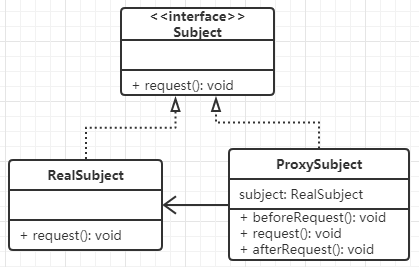 <br/>
静态代理 & 动态代理（InvocationHandler + Proxy）<br/>
#### 优点：
* 代理模式能够协调调用者和被调用者，在一定程度上降低了系统的耦合度。
* 远程代理使得客户端可以访问在远程机器上的对象，远程机器可能具有更好的计算性能与处理速度，可以快速响应并处理客户端请求。
* 虚拟代理通过使用一个小对象来代表一个大对象，可以减少系统资源的消耗，对系统进行优化并提高运行速度。
* 保护代理可以控制对真实对象的使用权限。
#### 缺点：
* 由于在客户端和真实主题之间增加了代理对象，因此有些类型的代理模式可能会造成请求的处理速度变慢。
* 实现代理模式需要额外的工作，有些代理模式的实现非常复杂。
#### 适用环境：
根据代理模式的使用目的，常见的代理模式有以下几种类型：
* 远程(Remote)代理：为一个位于不同的地址空间的对象提供一个本地 的代理对象，这个不同的地址空间可以是在同一台主机中，也可是在 另一台主机中，远程代理又叫做大使(Ambassador)。
* 虚拟(Virtual)代理：如果需要创建一个资源消耗较大的对象，先创建一个消耗相对较小的对象来表示，真实对象只在需要时才会被真正创建。
* Copy-on-Write代理：它是虚拟代理的一种，把复制（克隆）操作延迟 到只有在客户端真正需要时才执行。一般来说，对象的深克隆是一个 开销较大的操作，Copy-on-Write代理可以让这个操作延迟，只有对象被用到的时候才被克隆。
* 保护(Protect or Access)代理：控制对一个对象的访问，可以给不同的用户提供不同级别的使用权限。
* 缓冲(Cache)代理：为某一个目标操作的结果提供临时的存储空间，以便多个客户端可以共享这些结果。
* 防火墙(Firewall)代理：保护目标不让恶意用户接近。
* 同步化(Synchronization)代理：使几个用户能够同时使用一个对象而没有冲突。
* 智能引用(Smart Reference)代理：当一个对象被引用时，提供一些额外的操作，如将此对象被调用的次数记录下来等。
### 4、外观模式(Facade Pattern)
&emsp;&emsp;隐藏系统的复杂性，并向客户端提供了一个客户端可以访问系统的接口。外观模式又称为门面模式。<br/>
&emsp;&emsp;外部与一个子系统的通信必须通过一个统一的外观对象进行，为子系统中的一组接口提供一个一致的界面，外观模式定义了一个高层接口，这个接口使得这一子系统更加容易使用。<br/>
<b>类图：</b><br/>
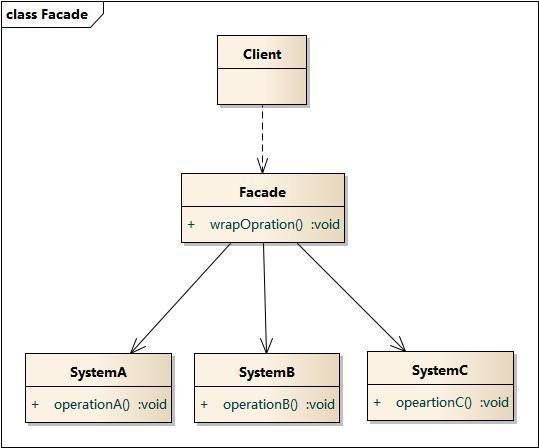 <br/>
<b>抽象外观类：</b><br/>
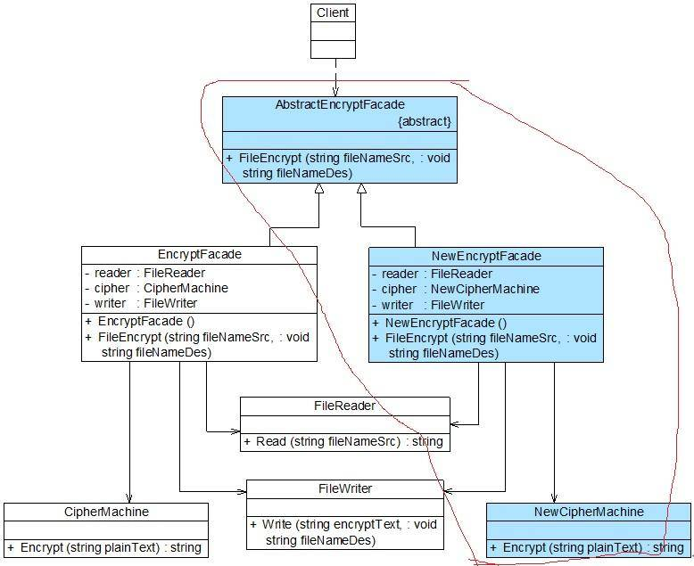 <br/>
#### 优点：
* 对客户屏蔽子系统组件，减少了客户处理的对象数目并使得子系统使用起来更加容易。通过引入外观模式，客户代码将变得很简单，与之关联的对象也很少。
* 实现了子系统与客户之间的松耦合关系，这使得子系统的组件变化不会影响到调用它的客户类，只需要调整外观类即可。
* 降低了大型软件系统中的编译依赖性，并简化了系统在不同平台之间的移植过程，因为编译一个子系统一般不需要编译所有其他的子系统。一个子系统的修改对其他子系统没有任何影响，而且子系统内部变化也不会影响到外观对象。
* 只是提供了一个访问子系统的统一入口，并不影响用户直接使用子系统类。
#### 缺点：
* 不能很好地限制客户使用子系统类，如果对客户访问子系统类做太多的限制则减少了可变性和灵活性。
* 在不引入抽象外观类的情况下，增加新的子系统可能需要修改外观类或客户端的源代码，违背了“开闭原则”。
#### 适用环境：
* 当要为一个复杂子系统提供一个简单接口时可以使用外观模式。该接口可以满足大多数用户的需求，而且用户也可以越过外观类直接访问子系统。
* 客户程序与多个子系统之间存在很大的依赖性。引入外观类将子系统与客户以及其他子系统解耦，可以提高子系统的独立性和可移植性。
* 在层次化结构中，可以使用外观模式定义系统中每一层的入口，层与层之间不直接产生联系，而通过外观类建立联系，降低层之间的耦合度。
##### 不要试图通过外观类为子系统增加新行为：
&emsp;&emsp;不要通过继承一个外观类在子系统中加入新的行为，这种做法是错误的。外观模式的用意是为子系统提供一个集中化和简化的沟通渠道，而不是向子系统加入新的行为，新的行为的增加应该通过修改原有子系统类或增加新的子系统类来实现，不能通过外观类来实现。
### 5、桥接模式(Bridge Pattern)
&emsp;&emsp;将抽象部分与它的实现部分分离，使它们都可以独立地变化。又称为柄体(Handle and Body)模式或接口(Interface)模式。<br/>
&emsp;&emsp;桥接模式将继承关系转换为关联关系，从而降低了类与类之间的耦合，减少了代码编写量。在有多种可能会变化的情况下，用继承会造成类爆炸问题，扩展起来不灵活。<br/>
<b>类图：</b><br/>
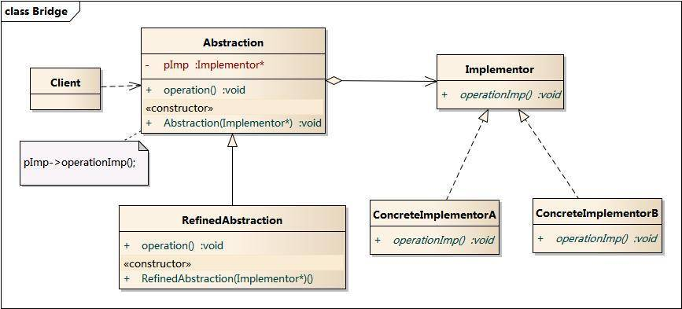 <br>
<b>Example:</b><br/>
<br/>
#### 优点：
* 分离抽象接口及其实现部分。
* 桥接模式有时类似于多继承方案，但是多继承方案违背了类的单一职责原则（即一个类只有一个变化的原因），复用性比较差，而且多继承结构中类的个数非常庞大，桥接模式是比多继承方案更好的解决方法。
* 桥接模式提高了系统的可扩充性，在两个变化维度中任意扩展一个维度，都不需要修改原有系统。
#### 缺点：
* 桥接模式的引入会增加系统的理解与设计难度，由于聚合关联关系建立在抽象层，要求开发者针对抽象进行设计与编程。
* 桥接模式要求正确识别出系统中两个独立变化的维度，因此其使用范围具有一定的局限性。
#### 适用环境：
* 如果一个系统需要在构件的抽象化角色和具体化角色之间增加更多的灵活性，避免在两个层次之间建立静态的继承联系，通过桥接模式可以使它们在抽象层建立一个关联关系。
* 抽象化角色和实现化角色可以以继承的方式独立扩展而互不影响，在程序运行时可以动态将一个抽象化子类的对象和一个实现化子类的对象进行组合，即系统需要对抽象化角色和实现化角色进行动态耦合。
* 一个类存在两个独立变化的维度，且这两个维度都需要进行扩展。
* 虽然在系统中使用继承是没有问题的，但是由于抽象化角色和具体化角色需要独立变化，设计要求需要独立管理这两者。
* 对于那些不希望使用继承或因为多层次继承导致系统类的个数急剧增加的系统，桥接模式尤为适用。

跨平台视频播放器，可以在不同操作系统平台（如Windows、Linux、Unix等）上播放多种格式的视频文件，常见的视频格式包括MPEG、RMVB、AVI、WMV等。可以使用桥接模式设计该播放器。
### 6、组合模式(Composite Pattern)
&emsp;&emsp;组合多个对象形成树形结构以表示具有“整体—部分”关系的层次结构。组合模式对单个对象（即叶子对象）和组合对象（即容器对象）的使用具有一致性，组合模式又可以称为“整体—部分”(Part-Whole)模式。<br/>
<b>透明组合模式类图：</b><br/>
 <br/>
&emsp;&emsp;透明组合模式的缺点是不够安全，因为叶子对象和容器对象在本质上是有区别的。叶子对象不可能有下一个层次的对象，即不可能包含成员对象，因此为其提供add()、remove()以及getChild()等方法是没有意义的，这在编译阶段不会出错，但在运行阶段如果调用这些方法可能会出错（如果没有提供相应的错误处理代码）
<b>安全组合模式类图：</b><br/>
 <br/>
&emsp;&emsp;安全组合模式的缺点是不够透明，因为叶子构件和容器构件具有不同的方法，且容器构件中那些用于管理成员对象的方法没有在抽象构件类中定义，因此客户端不能完全针对抽象编程，必须有区别地对待叶子构件和容器构件。
#### 优点：
* 组合模式可以清楚地定义分层次的复杂对象，表示对象的全部或部分层次，它让客户端忽略了层次的差异，方便对整个层次结构进行控制。
* 客户端可以一致地使用一个组合结构或其中单个对象，不必关心处理的是单个对象还是整个组合结构，简化了客户端代码。
* 在组合模式中增加新的容器构件和叶子构件都很方便，无须对现有类库进行任何修改，符合“开闭原则”。
* 组合模式为树形结构的面向对象实现提供了一种灵活的解决方案，通过叶子对象和容器对象的递归组合，可以形成复杂的树形结构，但对树形结构的控制却非常简单。
#### 缺点：
* 在增加新构件时很难对容器中的构件类型进行限制。有时候我们希望一个容器中只能有某些特定类型的对象，例如在某个文件夹中只能包含文本文件，使用组合模式时，不能依赖类型系统来施加这些约束，因为它们都来自于相同的抽象层，在这种情况下，必须通过在运行时进行类型检查来实现，这个实现过程较为复杂。
#### 适用场景：
* 在具有整体和部分的层次结构中，希望通过一种方式忽略整体与部分的差异，客户端可以一致地对待它们。
* 在一个使用面向对象语言开发的系统中需要处理一个树形结构。
* 在一个系统中能够分离出叶子对象和容器对象，而且它们的类型不固定，需要增加一些新的类型。
### 7、享元模式(Flyweight Pattern)
&emsp;&emsp;运用共享技术有效地支持大量细粒度对象的复用。系统只使用少量的对象，而这些对象都很相似，状态变化很小，可以实现对象的多次复用。由于享元模式要求能够共享的对象必须是细粒度对象，因此它又称为轻量级模式。<br/>

面向对象技术可以很好地解决一些灵活性或可扩展性问题，但在很多情况下需要在系统中增加类和对象的个数。当对象数量太多时，将导致运行代价过高，带来性能下降等问题。
享元模式正是为解决这一类问题而诞生的。
* 享元模式通过共享技术实现相同或相似对象的重用。
* 在享元模式中可以共享的相同内容称为内部状态(IntrinsicState)，而那些需要外部环境来设置的不能共享的内容称为外部状态(Extrinsic State)，由于区分了内部状态和外部状态，因此可以通过设置不同的外部状态使得相同的对象可以具有一些不同的特征，而相同的内部状态是可以共享的。
* 在享元模式中通常会出现工厂模式，需要创建一个享元工厂来负责维护一个享元池(Flyweight Pool)用于存储具有相同内部状态的享元对象。
* 在享元模式中共享的是享元对象的内部状态，外部状态需要通过环境来设置。在实际使用中，能够共享的内部状态是有限的，因此享元对象一般都设计为较小的对象，它所包含的内部状态较少，这种对象也称为细粒度对象。享元模式的目的就是使用共享技术来实现大量细粒度对象的复用。

<b>类图：</b><br/>
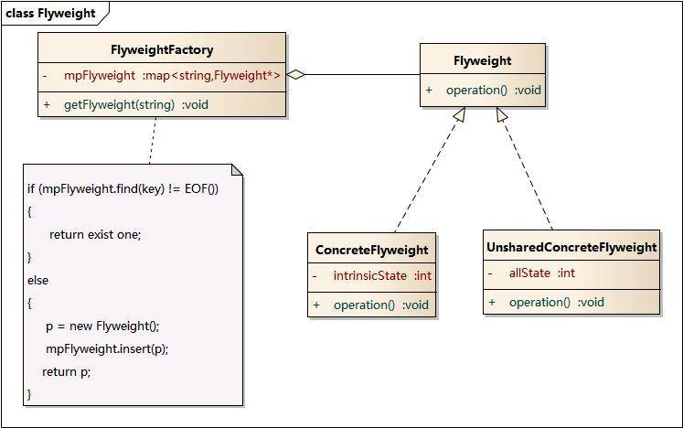 </br>
#### 优点：
* 享元模式的优点在于它可以极大减少内存中对象的数量，使得相同对象或相似对象在内存中只保存一份。
* 享元模式的外部状态相对独立，而且不会影响其内部状态，从而使得享元对象可以在不同的环境中被共享。
#### 缺点：
* 享元模式使得系统更加复杂，需要分离出内部状态和外部状态，这使得程序的逻辑复杂化
* 为了使对象可以共享，享元模式需要将享元对象的状态外部化，而读取外部状态使得运行时间变长。
#### 适用环境：
* 一个系统有大量相同或者相似的对象，由于这类对象的大量使用，造成内存的大量耗费。
* 对象的大部分状态都可以外部化，可以将这些外部状态传入对象中。
* 使用享元模式需要维护一个存储享元对象的享元池，而这需要耗费资源，因此，应当在多次重复使用享元对象时才值得使用享元模式。
---
## 四、行为型模式
&emsp;&emsp;行为型模式(Behavioral Pattern)是对在不同的对象之间划分责任和算法的抽象化。<br/>
&emsp;&emsp;行为型模式不仅仅关注类和对象的结构，而且重点关注它们之间的相互作用。
通过行为型模式，可以更加清晰地划分类与对象的职责，并研究系统在运行时实例对象 之间的交互。在系统运行时，对象并不是孤立的，它们可以通过相互通信与协作完成某些复杂功能，一个对象在运行时也将影响到其他对象的运行。<br/>

行为型模式分为<b>类行为型模式</b>和<b>对象行为型模式</b>两种：
* 类行为型模式：类的行为型模式使用继承关系在几个类之间分配行为，类行为型模式主要通过多态等方式来分配父类与子类的职责。
* 对象行为型模式：对象的行为型模式则使用对象的聚合关联关系来分配行为，对象行为型模式主要是通过对象关联等方式来分配两个或多个类的职责。根据“合成复用原则”，系统中要尽量使用关联关系来取代继承关系，因此大部分行为型设计模式都属于对象行为型设计模式。
### 1、策略模式(Strategy Pattern)
&emsp;&emsp;定义一系列算法，将每一个算法封装起来，并让它们可以相互替换。策略模式让算法独立于使用它的客户而变化，也称为政策模式(Policy)。<br/>
<b>类图：</b><br/>
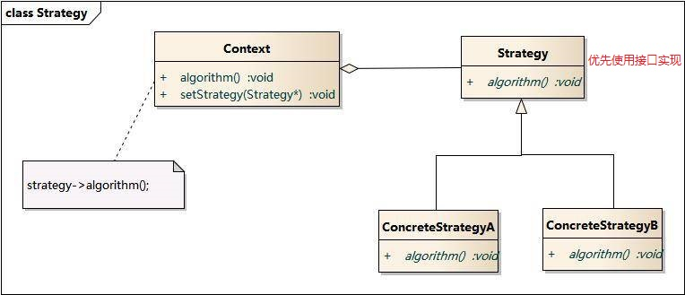 <br/>
#### 优点：
* 策略模式提供了对“开闭原则”的完美支持，用户可以在不修改原有系统的基础上选择算法或行为，也可以灵活地增加新的算法或行为。
* 策略模式提供了管理相关的算法族的办法。
* 策略模式提供了可以替换继承关系的办法。
* 使用策略模式可以避免使用多重条件转移语句。
#### 缺点：
* 客户端必须知道所有的策略类，并自行决定使用哪一个策略类。
* 策略模式将造成产生很多策略类，可以通过使用享元模式在一定程度上减少对象的数量。
#### 适用环境：
* 如果在一个系统里面有许多类，它们之间的区别仅在于它们的行为，那么使用策略模式可以动态地让一个对象在许多行为中选择一种行为。
* 一个系统需要动态地在几种算法中选择一种。
* 如果一个对象有很多的行为，如果不用恰当的模式，这些行为就只好使用多重的条件选择语句来实现。
* 不希望客户端知道复杂的、与算法相关的数据结构，在具体策略类中封装算法和相关的数据结构，提高算法的保密性与安全性
### 2、模板方法模式(Template Method Pattern)
&emsp;&emsp;定义一个操作中算法的框架，而将一些步骤延迟到子类中。模板方法模式使得子类可以不改变一个算法的结构即可重定义该算法的某些特定步骤。<br/>
<b>类图：</b><br/>
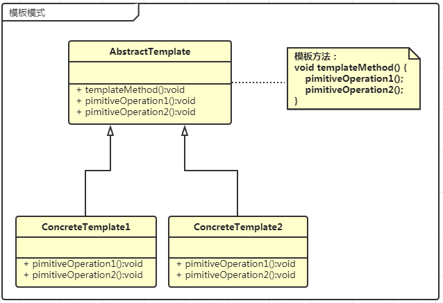 <br/>
#### 优点：
* 封装不变部分，扩展可变部分：把认为不变部分的算法封装到父类实现，可变部分则可以通过继承来实现，很容易扩展。
* 提取公共部分代码，便于维护。
* 行为由父类控制，由子类实现。父类控制流程，具体实现交由子类
#### 缺点：
* 模板方法模式颠倒了我们平常的设计习惯：抽象类负责声明最抽象、最一般的事物属性和方法，实现类实现具体的事物属性和方法。
* 在复杂的项目中可能会带来代码阅读的难度。
#### 适用环境：
* 设计者需要给出一个算法的固定步骤，并将某些步骤的具体实现交由子类实现。
* 需要对代码进行重构，将各个子类公共行为提取出来集中到一个共同的父类中以避免代码重复。
### 3、观察者模式(Observer Pattern)
&emsp;&emsp;定义对象间的一种一对多依赖关系，使得每当一个对象状态发生改变时，其相关依赖对象皆得到通知并被自动更新。观察者模式又叫做发布-订阅(Publish/Subscribe)模式、模型-视图(Model/View)模式、源-监听器(Source/Listener)模式或从属者(Dependents)模式。<br/>
<b>类图：</b><br/>
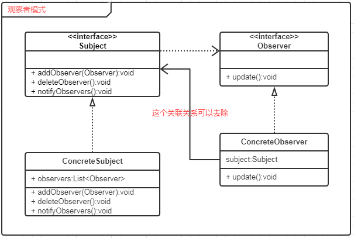 <br/>
#### 优点：
* 观察者模式可以实现表示层和数据逻辑层的分离，并定义了稳定的消息更新传递机制，抽象了更新接口，使得可以有各种各样不同的表示层作为具体观察者角色。
* 观察者模式在观察目标和观察者之间建立一个抽象的耦合。
* 观察者模式支持广播通信。
* 观察者模式符合“开闭原则”的要求。
#### 缺点：
* 如果一个观察目标对象有很多直接和间接的观察者的话，将所有的观察者都通知到会花费很多时间。
* 如果在观察者和观察目标之间有循环依赖的话，观察目标会触发它们之间进行循环调用，可能导致系统崩溃。
* 观察者模式没有相应的机制让观察者知道所观察的目标对象是怎么发生变化的，而仅仅只是知道观察目标发生了变化。
#### 适用环境：
* 一个抽象模型有两个方面，其中一个方面依赖于另一个方面。将这些方面封装在独立的对象中使它们可以各自独立地改变和复用。
* 一个对象的改变将导致其他一个或多个对象也发生改变，而不知道具体有多少对象将发生改变，可以降低对象之间的耦合度。
* 一个对象必须通知其他对象，而并不知道这些对象是谁。
* 需要在系统中创建一个触发链，A对象的行为将影响B对象，B对象的行为将影响C对象，可以使用观察者模式创建一种链式触发机制。
### 4、迭代器模式(Iterator Pattern)
&emsp;&emsp;提供一种方法来访问聚合对象，而不用暴露这个对象的内部表示，其别名为游标(Cursor)。<br/>
<b>类图：</b><br/>
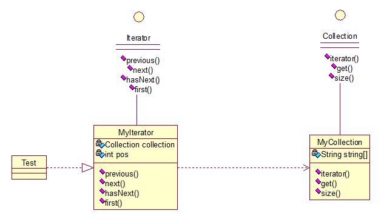 <br/>
#### 优点：
* 简化了遍历方式，对于对象集合的遍历，还是比较麻烦的，对于数组或者有序列表，我们尚可以通过游标来取得，但用户需要在对集合了解很清楚的前提下，自行遍历对象，但是对于hash表来说，用户遍历起来就比较麻烦了。而引入了迭代器方法后，用户用起来就简单的多了。
* 可以提供多种遍历方式，比如说对有序列表，我们可以根据需要提供正序遍历，倒序遍历两种迭代器，用户用起来只需要得到我们实现好的迭代器，就可以方便的对集合进行遍历了。
* 封装性良好，用户只需要得到迭代器就可以遍历，而对于遍历算法则不用去关心。
#### 缺点：
* 对于比较简单的遍历（像数组或者有序列表），使用迭代器方式遍历较为繁琐，大家可能都有感觉，像ArrayList，我们宁可愿意使用for循环和get方法来遍历集合。
#### 适用场景：
* 访问一个聚合对象的内容而无需暴露它的内部表示
* 支持对聚合对象的多种遍历
* 为遍历不同的聚合结构提供一个统一的接口
### 5、责任链模式(Chain of Responsibility Pattern)
&emsp;&emsp;避免请求发送者与接收者耦合在一起，让多个对象都有可能接收请求，将这些对象连接成一条链，并且沿着这条链传递请求，直到有对象处理它为止。<br/>
&emsp;&emsp;链接上的请求可以是一条链，可以是一个树，还可以是一个环，模式本身不约束这个，需要我们自己去实现，同时，在一个时刻，命令只允许由一个对象传给另一个对象，而不允许传给多个对象。<br/>
<b>类图：</b><br/>
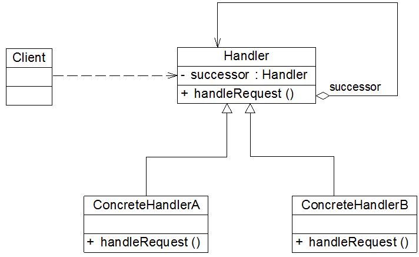 <br/>
职责链模式可分为<b>纯的职责链模式</b>和<b>不纯的职责链模式</b>两种：<br/>
* 纯的职责链模式：<br/>
&emsp;&emsp;要求一个具体处理者对象只能在两个行为中选择一个：要么承担全部责任，要么将责任推给下家，不允许出现某一个具体处理者对象在承担了一部分或全部责任后又将责任向下传递的情况。而且在纯的职责链模式中，要求一个请求必须被某一个处理者对象所接收，不能出现某个请求未被任何一个处理者对象处理的情况。
* 不纯的职责链模式：<br/>
&emsp;&emsp;允许某个请求被一个具体处理者部分处理后再向下传递，或者一个具体处理者处理完某请求后其后继处理者可以继续处理该请求，而且一个请求可以最终不被任何处理者对象所接收。
#### 优点：
* 职责链模式使得一个对象无须知道是其他哪一个对象处理其请求，对象仅需知道该请求会被处理即可，接收者和发送者都没有对方的明确信息，且链中的对象不需要知道链的结构，由客户端负责链的创建，降低了系统的耦合度。
* 请求处理对象仅需维持一个指向其后继者的引用，而不需要维持它对所有的候选处理者的引用，可简化对象的相互连接。
* 在给对象分派职责时，职责链可以给我们更多的灵活性，可以通过在运行时对该链进行动态的增加或修改来增加或改变处理一个请求的职责。
* 在系统中增加一个新的具体请求处理者时无须修改原有系统的代码，只需要在客户端重新建链即可，从这一点来看是符合“开闭原则”的。
#### 缺点：
* 由于一个请求没有明确的接收者，那么就不能保证它一定会被处理，该请求可能一直到链的末端都得不到处理；一个请求也可能因职责链没有被正确配置而得不到处理。
* 对于比较长的职责链，请求的处理可能涉及到多个处理对象，系统性能将受到一定影响，而且在进行代码调试时不太方便。
* 如果建链不当，可能会造成循环调用，将导致系统陷入死循环。
#### 适用场景：
* 有多个对象可以处理同一个请求，具体哪个对象处理该请求待运行时刻再确定，客户端只需将请求提交到链上，而无须关心请求的处理对象是谁以及它是如何处理的。
* 在不明确指定接收者的情况下，向多个对象中的一个提交一个请求。
* 可动态指定一组对象处理请求，客户端可以动态创建职责链来处理请求，还可以改变链中处理者之间的先后次序。
### 6、命令模式(Command Pattern)
&emsp;&emsp;将一个请求封装为一个对象，从而使我们可用不同的请求对客户进行参数化；对请求排队或者记录请求日志，以及支持可撤销的操作。其别名为动作(Action)模式或事务(Transaction)模式。
<b>类图：</b><br/>
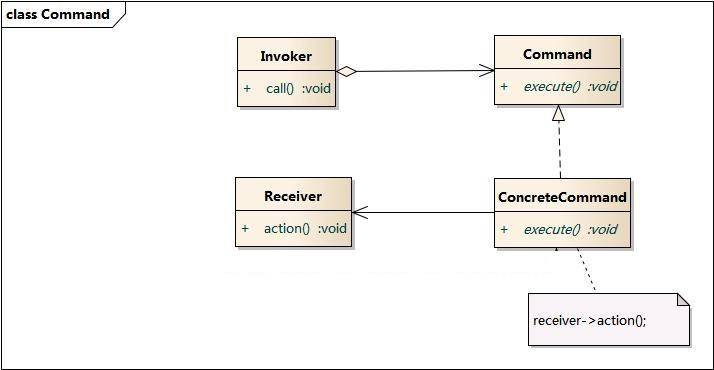 <br/>
命令模式的本质是对命令进行封装，将发出命令的责任和执行命令的责任分割开。<br/>
* 每一个命令都是一个操作：请求的一方发出请求，要求执行一个操作；接收的一方收到请求，并执行操作。
* 命令模式允许请求的一方和接收的一方独立开来，使得请求的一方不必知道接收请求的一方的接口，更不必知道请求是怎么被接收，以及操作是否被执行、何时被执行，以及是怎么被执行的。
* 命令模式使请求本身成为一个对象，这个对象和其他对象一样可以被存储和传递。
* 命令模式的关键在于引入了抽象命令接口，且发送者针对抽象命令接口编程，只有实现了抽象命令接口的具体命令才能与接收者相关联。
#### 优点：
* 降低系统的耦合度。
* 新的命令可以很容易地加入到系统中。
* 可以比较容易地设计一个命令队列和宏命令（组合命令）。
* 可以方便地实现对请求的Undo和Redo。
#### 缺点：
* 使用命令模式可能会导致某些系统有过多的具体命令类。因为针对每一个命令都需要设计一个具体命令类，因此某些系统可能需要大量具体命令类，这将影响命令模式的使用。
#### 适用环境：
* 系统需要将请求调用者和请求接收者解耦，使得调用者和接收者不直接交互。
* 系统需要在不同的时间指定请求、将请求排队和执行请求。
* 系统需要支持命令的撤销(Undo)操作和恢复(Redo)操作。
* 系统需要将一组操作组合在一起，即支持宏命令。
### 备忘录模式(Memento Pattern)
&emsp;&emsp;在不破坏封装的前提下，捕获一个对象的内部状态，并在该对象之外保存这个状态，这样可以在以后将对象恢复到原先保存的状态。其别名为Token。<br/>
<b>类图：</b><br/>
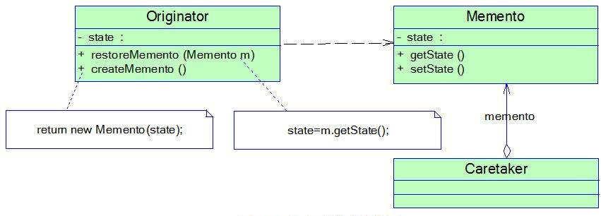 <br/>
#### 优点：
* 它提供了一种状态恢复的实现机制，使得用户可以方便地回到一个特定的历史步骤，当新的状态无效或者存在问题时，可以使用暂时存储起来的备忘录将状态复原。
* 备忘录实现了对信息的封装，一个备忘录对象是一种原发器对象状态的表示，不会被其他代码所改动。备忘录保存了原发器的状态，采用列表、堆栈等集合来存储备忘录对象可以实现多次撤销操作。
#### 缺点：
* 资源消耗过大，如果需要保存的原发器类的成员变量太多，就不可避免需要占用大量的存储空间，每保存一次对象的状态都需要消耗一定的系统资源。
#### 适用场景：
* 保存一个对象在某一个时刻的全部状态或部分状态，这样以后需要时它能够恢复到先前的状态，实现撤销操作。
* 防止外界对象破坏一个对象历史状态的封装性，避免将对象历史状态的实现细节暴露给外界对象。
### 8、状态模式(State Pattern)
&emsp;&emsp;允许一个对象在其内部状态改变时改变它的行为，对象看起来似乎修改了它的类。其别名为状态对象(Objects for States)。<br/>
<b>类图：</b><br/>
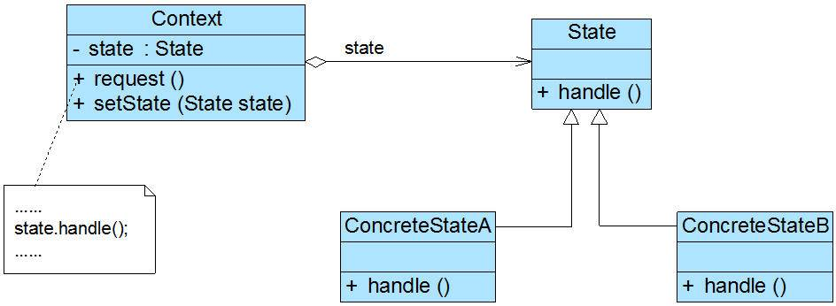 <br/>
#### 优点：
* 封装了转换规则。
* 枚举可能的状态，在枚举状态之前需要确定状态种类。
* 将所有与某个状态有关的行为放到一个类中，并且可以方便地增加新的状态，只需要改变对象状态即可改变对象的行为。
* 允许状态转换逻辑与状态对象合成一体，而不是某一个巨大的条件语句块。
* 可以让多个环境对象共享一个状态对象，从而减少系统中对象的个数。
#### 缺点：
* 状态模式的使用必然会增加系统类和对象的个数。
* 状态模式的结构与实现都较为复杂，如果使用不当将导致程序结构和代码的混乱。
* 状态模式对“开闭原则”的支持并不太好，对于可以切换状态的状态模式，增加新的状态类需要修改那些负责状态转换的源代码，否则无法切换到新增状态；而且修改某个状态类的行为也需修改对应类的源代码。
#### 适用环境：
* 对象的行为依赖于它的状态（属性）并且可以根据它的状态改变而改变它的相关行为。
* 代码中包含大量与对象状态有关的条件语句，这些条件语句的出现，会导致代码的可维护性和灵活性变差，不能方便地增加和删除状态，使客户类与类库之间的耦合增强。在这些条件语句中包含了对象的行为，而且这些条件对应于对象的各种状态。
### 9、访问者模式(Visitor Pattern)
&emsp;&emsp;提供一个作用于某对象结构中的各元素的操作表示，它使我们可以在不改变各元素的类的前提下定义作用于这些元素的新操作。<br/>
&emsp;&emsp;访问者模式适用于数据结构相对稳定算法又易变化的系统。因为访问者模式使得算法操作增加变得容易。<br/>
<b>类图：</b><br/>
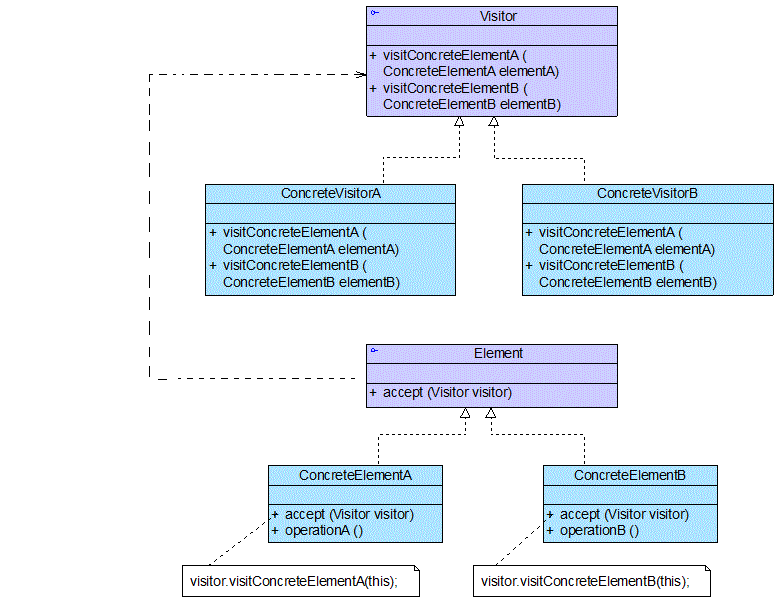 <br/>


### 10、中介者模式(Mediator Pattern)
&emsp;&emsp;用一个中介对象（中介者）来封装一系列的对象交互，中介者使各对象不需要显式地相互引用，从而使其耦合松散，而且可以独立地改变它们之间的交互。中介者模式又称为调停者模式。<br/>
<b>类图：</b><br/>
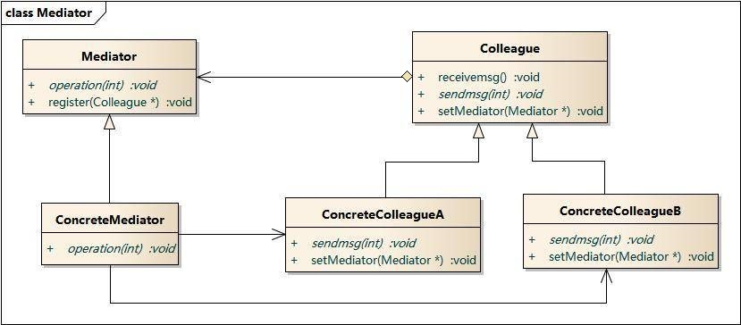 <br/>

<b>示例：</b><br/>
 <br/>
#### 优点：
* 简化了对象之间的交互。
* 将各同事解耦。
* 减少子类生成。
* 可以简化各同事类的设计和实现。
#### 缺点：
* 在具体中介者类中包含了同事之间的交互细节，可能会导致具体中介者类非常复杂，使得系统难以维护。
#### 适用环境：
* 系统中对象之间存在复杂的引用关系，产生的相互依赖关系结构混乱且难以理解。
* 一个对象由于引用了其他很多对象并且直接和这些对象通信，导致难以复用该对象。
* 想通过一个中间类来封装多个类中的行为，而又不想生成太多的子类。可以通过引入中介者类来实现，在中介者中定义对象。
* 交互的公共行为，如果需要改变行为则可以增加新的中介者类。
### 11、解释器模式(Interpreter Pattern)
&emsp;&emsp;定义一个语言的文法，并且建立一个解释器来解释该语言中的句子，这里的“语言”是指使用规定格式和语法的代码。<br/>
<b>类图：</b><br/>
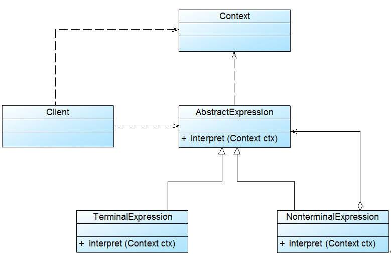 <br/>
#### 优点：
* 易于改变和扩展文法。由于在解释器模式中使用类来表示语言的文法规则，因此可以通过继承等机制来改变或扩展文法。
* 每一条文法规则都可以表示为一个类，因此可以方便地实现一个简单的语言。
* 实现文法较为容易。在抽象语法树中每一个表达式节点类的实现方式都是相似的，这些类的代码编写都不会特别复杂，还可以通过一些工具自动生成节点类代码。
* 增加新的解释表达式较为方便。如果用户需要增加新的解释表达式只需要对应增加一个新的终结符表达式或非终结符表达式类，原有表达式类代码无须修改，符合“开闭原则”。
#### 缺点：
* 对于复杂文法难以维护。在解释器模式中，每一条规则至少需要定义一个类，因此如果一个语言包含太多文法规则，类的个数将会急剧增加，导致系统难以管理和维护，此时可以考虑使用语法分析程序等方式来取代解释器模式。
* 执行效率较低。由于在解释器模式中使用了大量的循环和递归调用，因此在解释较为复杂的句子时其速度很慢，而且代码的调试过程也比较麻烦。
#### 适用场景：
* 可以将一个需要解释执行的语言中的句子表示为一个抽象语法树。
* 一些重复出现的问题可以用一种简单的语言来进行表达。
* 一个语言的文法较为简单。
<br/>
<br/>
<br/>

秉着不重复造轮子的思想，参考了下面的优秀文章：
1. https://github.com/simple-android-framework-exchange/android_design_patterns_analysis
2. https://design-patterns.readthedocs.io/zh_CN/latest/behavioral_patterns/behavioral.html
3. https://blog.csdn.net/zhangerqing/article/list/4
4. https://blog.csdn.net/taozi8023/article/category/6229427
5. http://www.runoob.com/design-pattern/design-pattern-tutorial.html

&copy;Copyright: KevinTu
